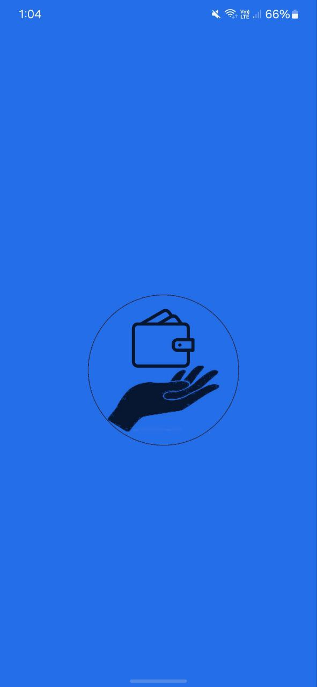
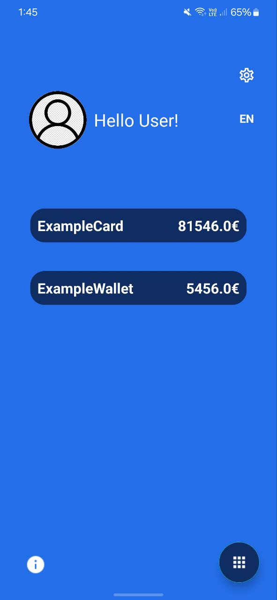
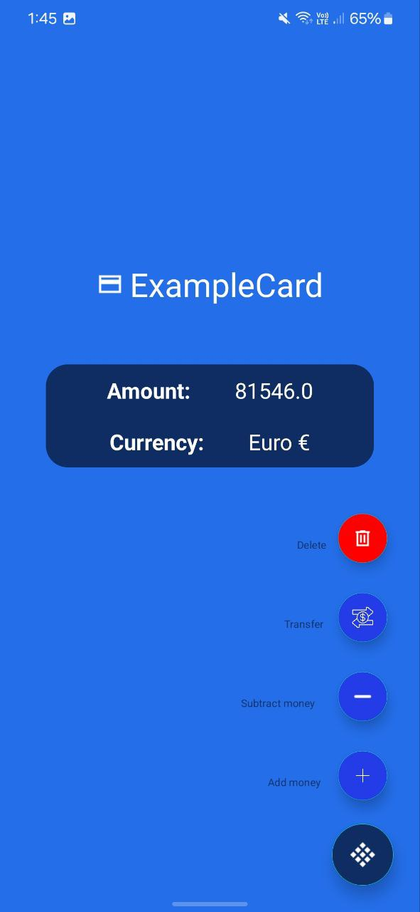
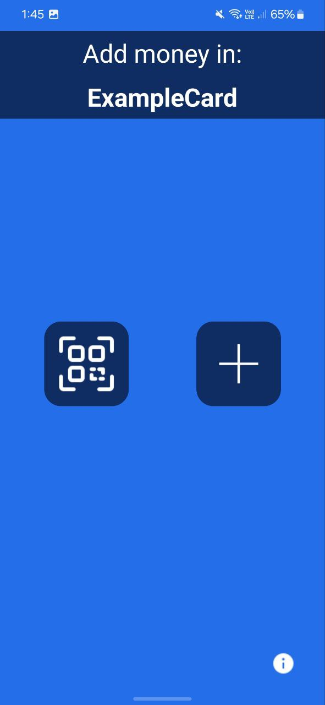
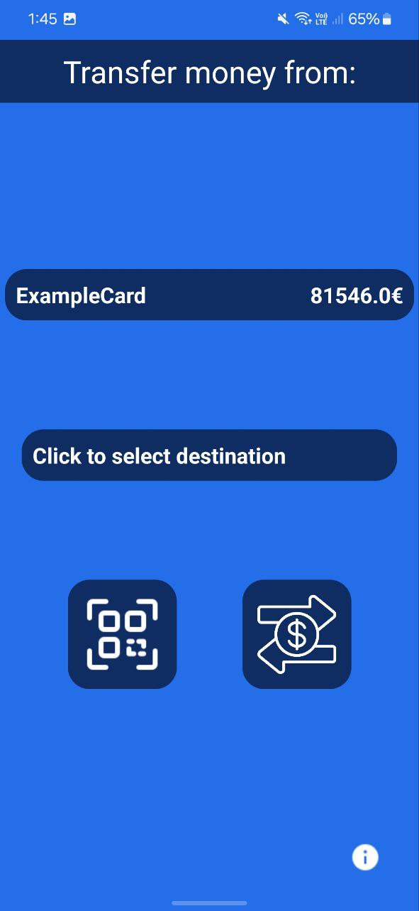
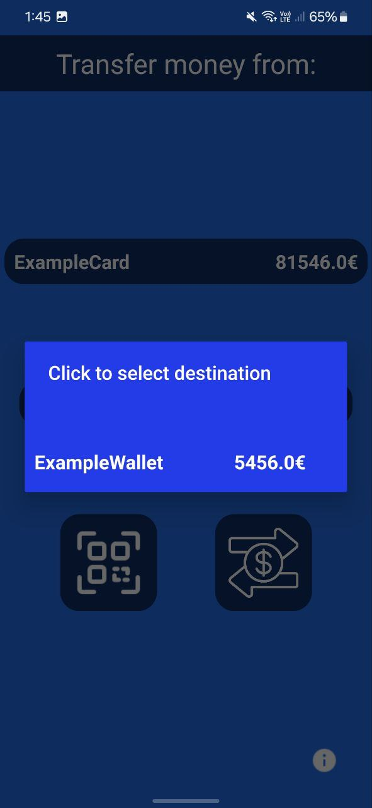
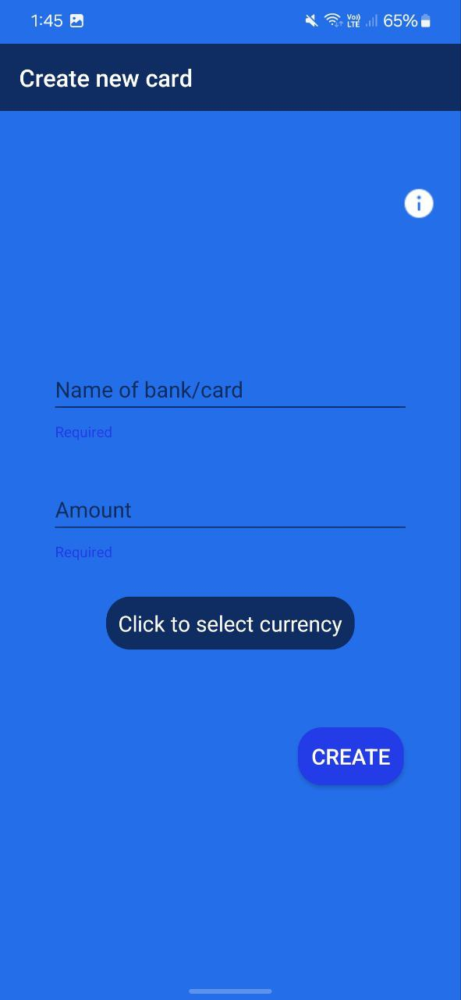
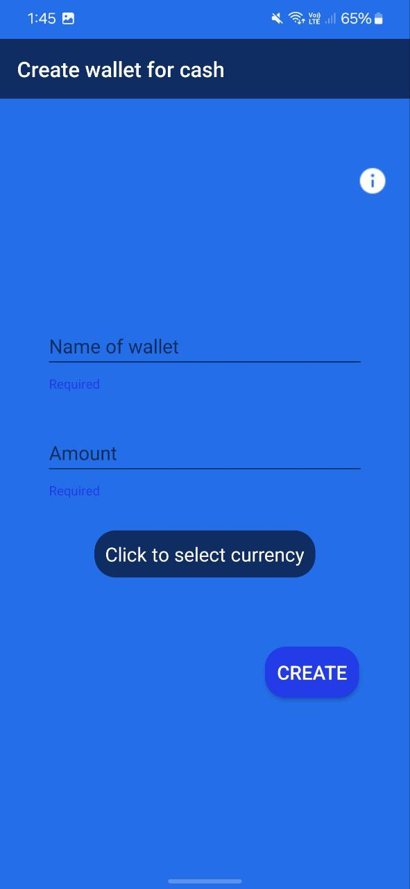
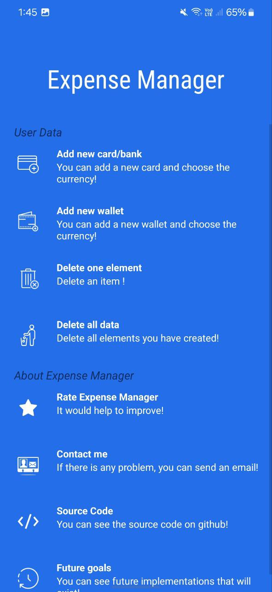
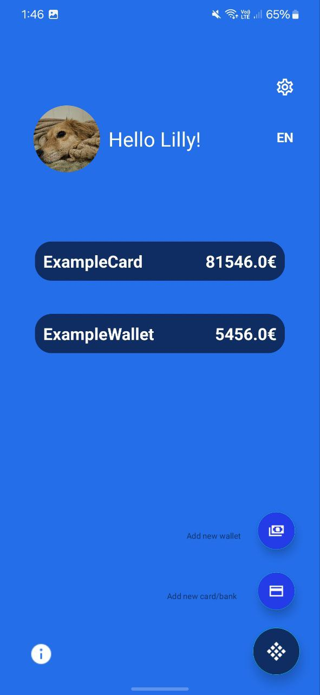

# About The App

This application was implemented within the framework of the postgraduate program "Computer Science". The idea came with the resurgence of the use of QR scanner in various fields. 
In this application the user can manage his finances without access to banking systems. He can create a Wallet and/or Bank/Card and give the app the exact amount he has. Through this he can add, remove or transfer funds either manually(by giving the amount of money) or by scanning a receipt. In addition, the user can change his name and photo given by the application. Finally, he is also given the option to delete all data and start the application from the beginning again!

# Download

Download Expense Manager from Google Play.

# Screenshots

